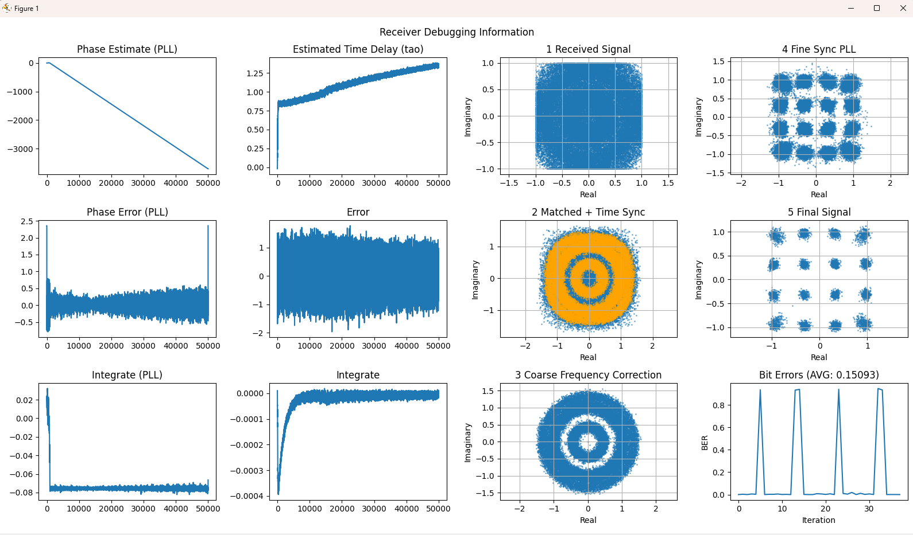
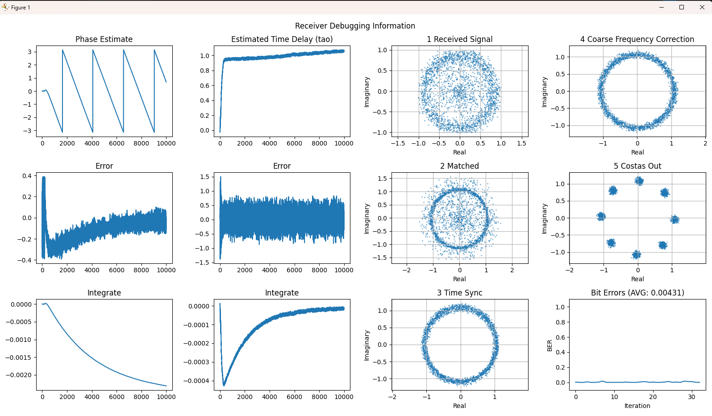

# python_sim

Signal processing simulations for QAM/DPSK transmission and reception. The project contains Python implementations of key synchronization and correction loops (timing, carrier recovery, and decision-directed loops) plus TX/RX demo scripts.

Note: This project is under construction and intended for educational purposes.

## Contents

- TX scripts: `TX_qam.py`, `TX_dpsk.py`
- RX scripts: `RX_qam.py`, `RX_dpsk.py`
- Core DSP blocks:
  - `coarse_frequency_correction.py`
  - `costas_loop.py`
  - `mthpower_loop.py`
  - `time_synchronizer.py`
  - `qam_fine_sync.py`
  - `qam_fine_sync_pll.py`
  - `qam_decision_directed_loop.py`
  - `rcosdesign_custom.py`
  - `psk_code.py`
  - `qam.py`

## Requirements

- Python 3.8+
- Common scientific stack (NumPy, SciPy, Matplotlib). If these are missing, install them with your preferred package manager.

## Quick start

Run a QAM transmit simulation:

- `python TX_qam.py`

Run a QAM receive simulation:

- `python RX_qam.py`

Run DPSK TX/RX:

- `python TX_dpsk.py`
- `python RX_dpsk.py`

## Processing workflow

QAM transmitter flow in [TX_qam.py](TX_qam.py):

- Build header + random payload, save as `message_tx.txt`.
- Map symbols to the QAM constellation and normalize average power.
- Oversample by `OF` (zero-stuffing).
- Pulse shape with `rcosdesign_custom()` and `scipy.signal.convolve()`.
- Send samples continuously with `usrp.send_waveform()`.

QAM receiver flow in [RX_qam.py](RX_qam.py):

- Acquire samples from the USRP with `usrp.recv_num_samps()`.
- Matched filter using `rcosdesign_custom()` + convolution.
- Timing recovery via `time_synchronizer()` (Gardner).
- Coarse carrier correction with `coarse_frequency_correction()`.
- Fine carrier/phase tracking using `qam_fine_sync_pll()`.
- Frame detection by correlating against the known header.
- Phase de-rotation using header-based angle estimate.
- Hard-decision demodulation (minimum-distance to constellation).
- BER calculation against `message_tx.txt` and debug plots.

DPSK transmitter flow in [TX_dpsk.py](TX_dpsk.py):

- Build header + random payload, save as `message_tx.txt`.
- Differential phase accumulation (DPSK) to generate `psk_mod`.
- Oversample by `OF` (zero-stuffing).
- Pulse shape with `rcosdesign_custom()` and convolution.
- Send samples continuously with `usrp.send_waveform()`.

DPSK receiver flow in [RX_dpsk.py](RX_dpsk.py):

- Acquire samples from the USRP with `usrp.recv_num_samps()`.
- Matched filter using `rcosdesign_custom()` + convolution.
- Timing recovery via `time_synchronizer()` (Gardner).
- Coarse carrier correction with `coarse_frequency_correction()`.
- Carrier/phase tracking with `costas_loop()`.
- Differential demodulation using phase differences between symbols.
- Frame detection by correlating against the known header.
- BER calculation against `message_tx.txt` and debug plots.

## Demo outputs

QAM RX demo output (constellation and synchronization behavior):

Parameters used for this demo output (from [RX_qam.py](RX_qam.py)):

- `M = 16`, `OF = 2`, `debug_level = 1`
- `center_freq = 2.4e9`, `sample_rate = 1e6`, `gain = 60`
- Matched filter: `beta = 0.4`, `span = 10`, `sps = OF`
- Fine sync PLL: `alpha = 0.1`, `beta = 0.005`, `gain_alpha = 0.02`

DPSK RX demo output (phase tracking and symbol decisions):

Parameters used for this demo output (from [RX_dpsk.py](RX_dpsk.py)):

- `len_msg = 10000`, `M = 8`, `OF = 2`, `debug_level = 1`
- `center_freq = 2.4e9`, `sample_rate = 1e6`, `gain = 60`
- Matched filter: `beta = 0.4`, `span = 10`, `sps = OF`

## Notes

- The scripts are intended to be executed from the project root folder.
- Update the USRP serial numbers in the TX/RX scripts to match your hardware before running.

## Troubleshooting

- If a script fails, verify your Python version and installed dependencies.
- If plots do not appear, ensure your Matplotlib backend is configured correctly.

